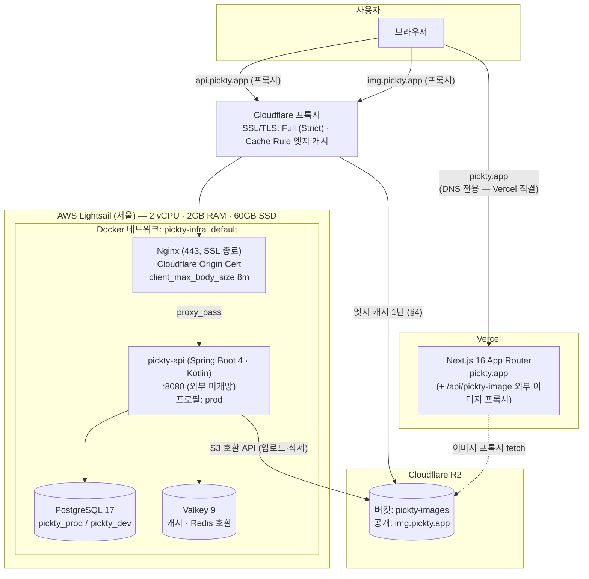
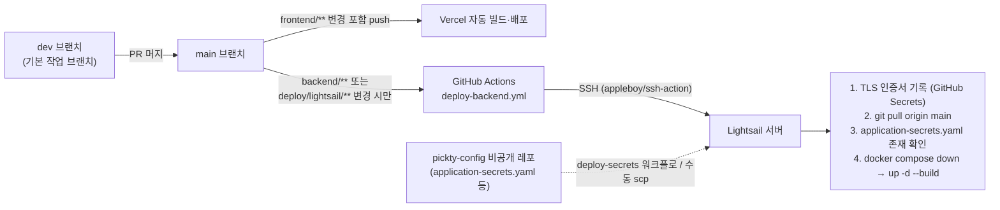
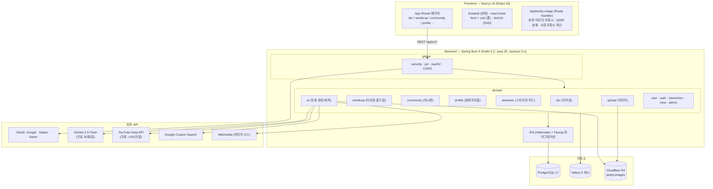
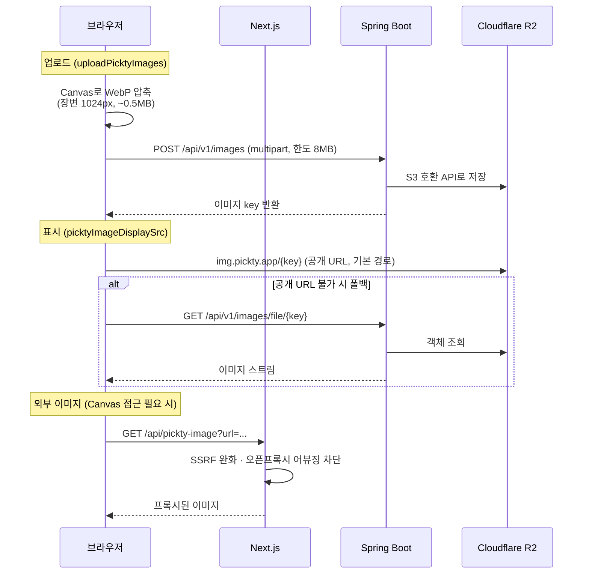
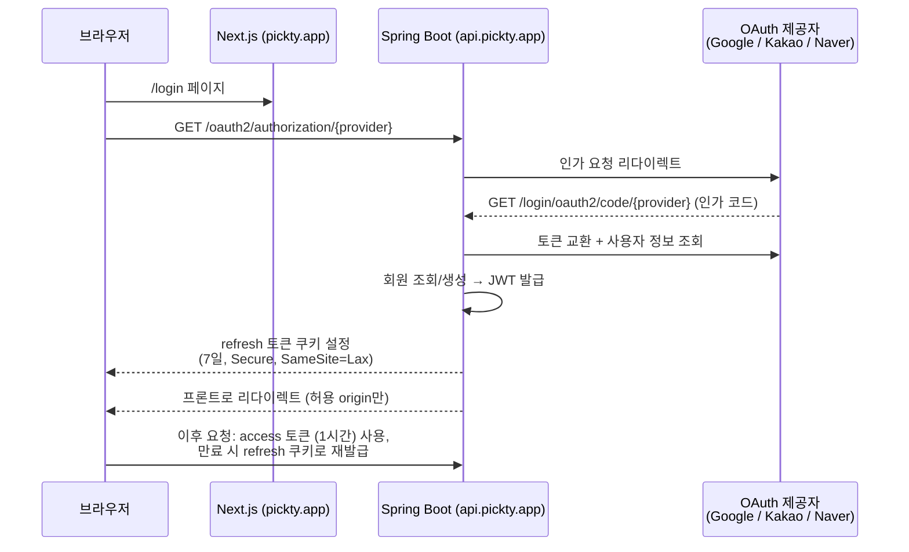
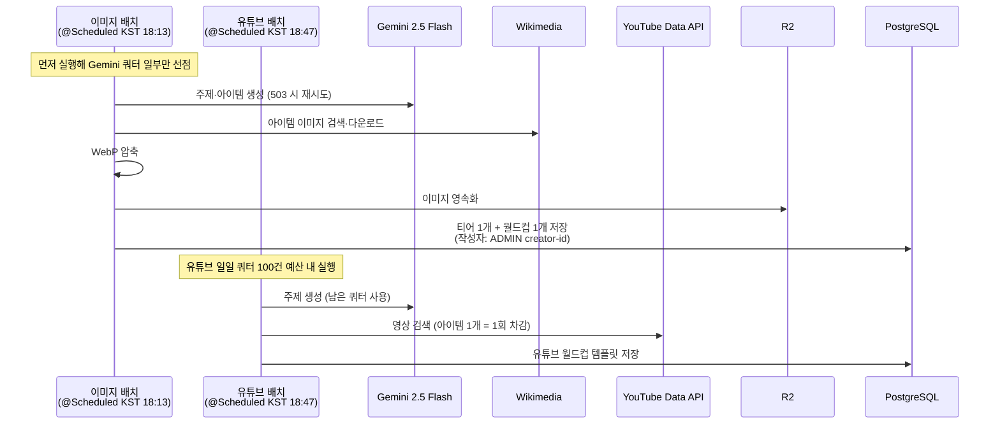

# Pickty 아키텍처 · 인프라 구성도

> 다이어그램은 Mermaid로 작성. GitHub · VSCode(미리보기) · Cursor에서 바로 렌더링됨.
> 인프라가 바뀌면 이 문서의 해당 블록만 수정할 것.

---

## 1. 인프라 / 배포 구성도

운영 환경 전체 그림. 프론트(Vercel)와 백엔드(Lightsail)가 분리 배포되고, 이미지는 Cloudflare R2가 담당한다.

### 배포 파이프라인

- 프론트만 고친 push는 GitHub Actions가 **돌지 않는 게 정상** — Vercel 빌드를 확인할 것.
- 시크릿은 Pickty 레포에 없음. `pickty-config` 비공개 레포에서 서버로 배치.

---

## 2. 시스템 아키텍처 (논리 구조)

---

## 3. 주요 플로우

### 3-1. 이미지 업로드 · 표시

### 3-2. 소셜 로그인 (OAuth2 + JWT)

### 3-3. AI 콘텐츠 자동 생성 배치

Gemini 무료 한도(20회/일, 실패도 차감)를 두 배치가 공유. 미국 한낮(KST 새벽) 503 회피를 위해 KST 저녁대에 실행.

---

## 4. 이미지 캐시 전략

이미지 URL은 **불변(immutable)** 을 전제로 설계됨. 업로드마다 새 UUID 키가 발급되고(`R2ImageStorageService` — 같은 키에 덮어쓰기 경로 없음), "이미지 수정"은 항상 새 업로드 + DB 참조 교체로 처리한다.

| 레이어 | 설정 | 위치 |
|--------|------|------|
| Cloudflare 엣지 | Cache Rule로 `img.pickty.app` 전체 + `/api/v1/images/file/*` 경로를 엣지·브라우저 TTL 1년 강제 캐싱 (원본 헤더 무시) | Cloudflare 대시보드 (레포 밖) |
| 백엔드 file API | `Cache-Control: public, max-age=31536000, immutable` | `ImageUploadController` |
| Next.js 이미지 프록시 | 1일~1시간 + stale-while-revalidate (외부 URL은 불변 보장이 없으므로 짧게) | `pickty-image/route.ts` |

### 지켜야 할 불변식

- **저장된 객체 키에 절대 덮어쓰지 않는다.** 같은 키에 다른 내용을 쓰면 엣지·브라우저에 최대 1년 묵은 이미지가 남는다. 내용이 바뀌면 반드시 새 키 발급.
- R2 고아 객체 정리(`ImageCleanupService`)로 객체를 지워도 **엣지 캐시는 자동으로 비워지지 않는다.** 즉시 노출 중단이 필요한 삭제(개인정보 등)는 Cloudflare 캐시 퍼지(URL 단위)를 별도로 수행해야 한다.

---

## 5. 환경 구분

| 환경 | Spring 프로필 | DB | 비고 |
|------|---------------|-----|------|
| 운영 | `prod` | `pickty_prod` (Lightsail) | `main` 머지로만 배포 |
| 공용 개발 | `dev` (기본) | `pickty_dev` (Lightsail) | `./gradlew bootRun` |
| 로컬 격리 | `local` | `pickty` (로컬 Docker, 호스트 5442) | `./gradlew bootRunLocal`, Valkey 6380 |

- 단일 Postgres 인스턴스에 `pickty` / `pickty_dev` / `pickty_prod` DB를 분리 운영.
- 프론트 로컬: `cd frontend && npm run dev` → `localhost:3002`.

---

## 6. 외부 콘솔 및 보안 설정 (Console & Security Configuration)

> 레포 코드만으로는 추적할 수 없는 웹 콘솔 설정 기록. **공개 레포이므로 시크릿 값·IP 주소 등 구체 값은 적지 않는다** — 설정의 존재와 개념만 기록. (확인일: 2026-06)

### Cloudflare

| DNS 레코드 | 대상 | 프록시 상태 |
|------------|------|-------------|
| `pickty.app` (A) | Vercel | **DNS 전용** (회색 구름 — Vercel 직결, Cloudflare 규칙 미적용) |
| `api.pickty.app` (A) | Lightsail | **프록시 ON** (주황 구름) |
| `img.pickty.app` (CNAME) | R2 커스텀 도메인 | **프록시 ON** (주황 구름) |

- SSL/TLS 암호화 모드: **Full (Strict)** — Cloudflare Origin Certificate 기반으로 원본 인증서까지 엄격 검증
- Cache Rule "Pickty Image Cache" (우선순위 1) — 상세는 §4 이미지 캐시 전략 참조
- WAF·봇 보안: 커스텀 차단 규칙 없음, 기본 보안 모드

### AWS Lightsail

- 인스턴스: **2 vCPU · 2GB RAM · 60GB SSD** (서울 리전)
- IPv4 방화벽 (최소 개방 원칙):
  - 외부 개방: `22(SSH)` · `443(HTTPS)` 뿐 — `80(HTTP)`은 규칙에서 제거됨 (Nginx가 443만 리슨하므로 불필요)
  - `5432(PostgreSQL)` · `6379(Valkey)`: **지정된 개발 PC IP 화이트리스트만 허용** (구체 IP는 비공개)
- 백업: 차후 활성 사용자 발생 시 상용 백업 정책으로 **인스턴스 스냅샷 도입 예정**

### Google Cloud Platform (API 키)

| 키 | API 제한 | 비고 |
|----|----------|------|
| Gemini | Gemini API 전용 | — |
| YouTube Search | YouTube Data API v3 전용 | — |
| Custom Search | Custom Search API 전용 | 현재 외부 요인으로 사용 불가 상태 |

- 모든 키는 기능별 API 접근 제한 적용 완료. 현재 무료 티어 활용 단계로, 향후 유료 플랜 전환 시 **서버 고정 IP 제한(애플리케이션 제한)** 적용 예정.

### Vercel

- 환경변수: `NEXT_PUBLIC_API_URL`, `NEXT_PUBLIC_GA_ID` 등 콘솔에서 주입 (값은 콘솔에서만 관리)
- 프로덕션 도메인: `pickty.app`, `pickty.vercel.app`

### 소셜 로그인 콘솔

- **Kakao Developers**: **비즈 앱** 전환 완료
- **Google OAuth (GCP)**: 승인된 도메인에 운영(`pickty.app`)과 로컬 테스트 환경(`*.ngrok-free.dev`) 매핑. 앱 상태는 정식 검수 전 단계
- **Naver Developers**: 애플리케이션 상태 **[서비스 적용]** (운영 모드) 활성화

### GitHub

- 기본 브랜치: **`dev`** (작업 베이스) — `main`은 배포 트리거 전용, PR 머지로만 반영
- 브랜치 보호 규칙: 현재는 시스템 강제 없이 개발 편의를 위해 **자율적 관례 플로우**로 운영 중. 향후 협업 규모 확장 시 보호 규칙 도입 검토 예정
- Actions Secrets: Lightsail SSH 접속 정보(host·username·key)와 TLS 인증서(cert·key) — `deploy-backend.yml`에서 사용
