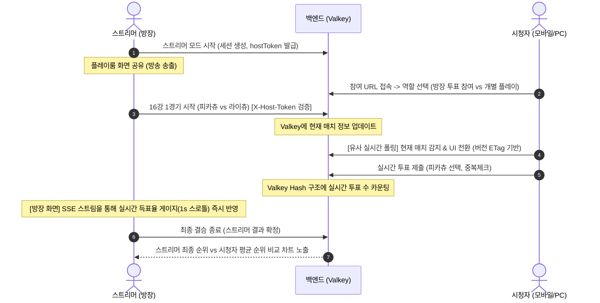

# [기획/설계] 스트리머-시청자 실시간 참여 모드 (Streamer Mode)

본 문서는 스트리머가 방송 중 시청자들과 실시간으로 상호작용하여 티어표를 매기거나 이상형 월드컵의 선택을 비교할 수 있는 **스트리머 모드**의 기획안 및 기술 아키텍처 설계입니다. 
인프라 비용과 복잡도를 최소화하기 위해 **웹소켓(WebSocket) 대신 Valkey(메모리 캐시)와 유사 실시간(Pseudo-Realtime) HTTP 폴링** 구조를 지향하며, 트래픽 과부하 및 보안 취약점을 해결하는 안전장치를 내장합니다.

---

## 1. 기획 배경 및 핵심 가치

* **UGC 플랫폼의 확장**: 단순한 개인 플레이를 넘어, **스트리머-시청자 간의 실시간 소통 허브**로 Pickty의 가치를 극대화합니다.
* **실시간 양방향 콘텐츠**: 스트리머가 "얘가 S급일까?", "피카츄 vs 라이츄 뭐 고르지?" 하고 고민할 때, 시청자들의 실시간 반응을 즉시 데이터로 시각화하여 방송의 몰입도를 높입니다.
* **결과 비교의 재미**: 게임이 끝난 후 스트리머의 취향(결과)과 시청자 집단의 통계(평균 결과)를 시각적으로 대조하여 흥미로운 피드백과 소통 요소를 창출합니다.

---

## 2. 시나리오별 사용자 흐름 (UX Flow)

### 2.1. [이상형 월드컵] 실시간 대진 예측 및 결과 대조



1. **세션 활성화**: 스트리머가 월드컵 방을 만들면 고유 UUID 세션(`sessionId`)과 함께 방장 검증을 위한 `hostToken`이 발급됩니다.
2. **실시간 매치 동기화**: 
   * 스트리머가 화면에서 대진을 진행할 때마다(예: 16강 1경기 피카츄 vs 라이츄), 백엔드의 Valkey 세션 상태가 업데이트됩니다.
   * 시청자 화면은 유사 실시간으로 동기화되어 현재 대진의 두 아이템이 나타나며, 시청자는 둘 중 하나에 실시간으로 투표합니다.
3. **방장 플레이룸 내 투표 노출**:
   * 스트리머는 따로 오버레이를 설정할 필요 없이 본인의 플레이룸 웹 화면에 나타나는 시청자 실시간 투표 비율을 보고 소통합니다.

### 2.2. [티어표] 시청자 평균 배치도 및 실시간 통계
1. **시청자 개별 플레이**:
   * 시청자가 `/streamer/{sessionId}`에 접속 후 "나만의 플레이 완성하기"를 선택하면 동일한 템플릿의 드래그 앤 드롭 보드가 주어집니다.
   * 시청자들은 방송을 보며 자기 보드를 완성한 뒤 **[제출하기]**를 누릅니다.
2. **실시간 통계 집계 (Valkey)**:
   * 백엔드는 수집된 시청자들의 개별 티어 배치 데이터(`아이템 A -> S등급`)를 Valkey 내에서 누적 계산합니다.
3. **스트리머 화면 시각화**:
   * **최소 표본 수 정책:** 수집된 총 완성 본수가 **10표 미만**일 경우 통계 신뢰성을 위해 방장 화면에는 `"데이터 수집 중 (N/10)"`으로 보이며 평균 뷰가 제한됩니다.
   * **마우스 호버/포커스 뷰 (10표 이상 시):** 스트리머가 보드 위에서 특정 아이템을 가리키거나 들고 있을 때, 해당 아이템 옆에 **[시청자 평균 등급: A (4.32)]** 같은 정밀한 소수점 수치가 포함된 통계 툴팁이 오버레이됩니다.
   * **평균 티어표 뷰 (Toggle):** 스트리머가 버튼 하나로 '시청자 집단 지성 뷰'를 활성화하면, 전체 아이템들이 시청자들의 가중 평균 등급(반올림 계산) 위치로 자동 정렬되어 보여집니다.
     * **비파괴적 토글 (Non-destructive):** 이 뷰는 임시 오버레이며, 토글을 다시 끄면 기존에 스트리머가 수동으로 드래그하던 원래의 보드 배치 상태로 완벽히 복원됩니다.

### 2.3. [즉석 피드백] 특정 아이템 실시간 퀵 투표 (Quick Tier Vote)
방송을 시청하다가 사이트 전체를 기동해 무겁게 티어표 전체를 제출하는 시청자 행동 장벽을 완화하고, 채팅보다 훨씬 직관적인 **정량적 리액션**을 얻기 위한 기능입니다.

* **UX 흐름**:
  1. 스트리머가 특정 아이템에 대해 "여러분, 다리우스 S등급인가요 A등급인가요? 의견 주세요!" 하고 버튼을 누르면, 시청자들의 화면 상단에 **실시간 라이브 알림 토스트/배너**가 노출됩니다.
  2. 시청자가 배너를 탭하면 바텀 시트가 열리며 **해당 아이템의 썸네일과 함께 등급(S, A, B, C, D) 대형 선택 버튼**이 나타납니다.
  3. 시청자는 1초 만에 등급 버튼을 클릭하고, 결과는 스트리머 플레이룸 화면에 실시간 게이지 차트로 즉각 집계됩니다.
  4. **시청자 화면 결과 피드백:** 시청자 역시 자신의 투표를 제출하고 나면 본인의 바텀 시트 내에 실시간 득표율 차트(예: S 12%, A 78% ...)를 즉시 확인(Twitch Poll 스타일)할 수 있습니다.

---

## 3. 기술 아키텍처 및 트래픽 과부하 제어

웹소켓을 배제하고 **Valkey 9.x 캐시**와 **최적화된 유사 실시간(Pseudo-Realtime) HTTP 폴링** 구조를 결합합니다.

```
[시청자 브라우저 (수천 명)]
      │
      ├─► (가변 폴링 + ETag 304 헤더 검증) ─► [Spring Boot API (Valkey 캐시 우선)] 
      │                                                │
      └─► (투표/제출 API - Write-Only)    ─►           ▼  (초고속 인메모리 Read/Write)
                                               [Valkey (Cache Memory)]
                                                       │
[방장 브라우저 (스트리머)]                              ▼  (배치/세션 종료 후 영속화)
      │                                        [PostgreSQL (Persistent DB)]
      └─► (SSE 연결 - Ticket 기반 인증) ───────────────┘
          [이벤트 + 1초 스로틀 득표수 수신]
```

### 3.1. 웹소켓을 배제하는 이유와 Valkey의 대안
* **비용 및 서버 안정성**: 가상 서버(Lightsail) 환경에서 수천 명의 웹소켓 커넥션을 지속적으로 유지하는 것은 메모리 및 CPU 스레드 고갈을 일으킵니다.
* **Valkey 캐싱 성능**: Valkey는 싱글 스레드 기반 인메모리 데이터베이스로 초당 수만 건의 읽기/쓰기를 리소스 소모 없이 안정적으로 감당합니다.

### 3.2. 트래픽 과부하 제어 (Traffic Control)
시청자 수 5,000명 기준 3초 폴링 시 초당 약 1,667회 요청이 유입되어 Tomcat 스레드가 마비될 수 있습니다. 이를 막기 위해 아래의 3가지 방어막을 구축합니다.

1. **동적 백오프 폴링 (Dynamic Backoff Polling)**:
   * 백엔드는 Valkey에 저장된 실시간 동시 접속자 수(HyperLogLog로 수집)를 감지합니다.
   * `status` API 응답 바디에 다음 폴링 시간 가이드(`nextPollInterval`)를 내려주며, 인원이 많아질수록 클라이언트의 폴링 주기를 늘립니다.
   * **진동 방지(Hysteresis) 정책:** 경계값 주변에서 폴링 주기가 출렁거리는 것을 막기 위해 상/하향 임계치에 마진을 둡니다.
     * 3초 $\rightarrow$ 6초 전환 임계치: **1,050명 이상**일 때
     * 6초 $\rightarrow$ 3초 복귀 임계치: **950명 이하**로 내려갈 때
     * 6초 $\rightarrow$ 10초 전환 임계치: **3,150명 이상**일 때
     * 10초 $\rightarrow$ 6초 복귀 임계치: **2,850명 이하**로 내려갈 때
2. **HyperLogLog 슬라이딩 윈도우 동접자 산정:**
   * 분 단위 키 회전 기법을 사용하여 퇴장한 시청자가 중복 누적되는 현상을 방어합니다.
   * 폴링 요청 시 현재 분(minute)에 해당하는 키 `streamer:session:{sessionId}:active-users:{YYYYMMDDHHmm}` (TTL: 3분)에 `PFADD`를 가합니다.
   * 동적 백오프 기준값 산출 시에는 **최근 2분간의 HLL 키를 `PFMERGE`하여 합산된 고유 유저 수를 계측**합니다.
3. **HTTP ETag / 304 Not Modified 활용 (시청자)**:
   * Valkey에 세션의 현재 상태 버전(`version` 정수 필드)을 유지합니다. 방장이 매치를 변경하거나 퀵 투표를 열 때만 `version`이 +1 증가합니다.
   * 시청자는 실시간 득표수 변화를 직접 볼 필요가 없으므로 헤더에 `If-None-Match: "v{version}"`을 전송합니다.
   * 백엔드는 Valkey의 현재 버전과 요청 헤더를 비교하여, 변경이 없을 시 **JSON 직렬화 및 바디 생성 없이 즉시 `304 Not Modified` 공백 응답**을 리턴해 네트워크 I/O 및 CPU 부하를 거의 제로 수준으로 유지합니다.
4. **방장 전용 SSE 채널 및 득표수 스로틀링 (스트리머)**:
   * 스트리머 본인은 실시간 투표 게이지 변화를 지켜보아야 하므로 **SSE(Server-Sent Events) 연결**을 통해 변경 정보를 실시간으로 받아오게 합니다.
   * **득표수 스로틀링:** 매 투표 제출 시마다 SSE 이벤트를 발생시키지 않고, 백엔드에서 득표수 집계 값을 **최대 1초 간격으로 스로틀링(Throttled Push)** 하여 방장에게만 주기적으로 밀어줍니다.

---

## 4. 인증 및 보안 (Authentication & Anti-Abuse)

### 4.1. 세션 제어 권한 검증 (`hostToken` & Fallback)
* 스트리머 세션 생성 시 UUID 포맷의 `hostToken`이 발급되며 방장 브라우저의 **`localStorage`**에 보관되어 다중 탭 및 새로고침 환경에서도 토큰이 보존되게 합니다.
* 방장의 세션 제어 API 호출(`PUT /sessions/{id}/match` 등) 시 HTTP 헤더에 `X-Host-Token`을 반드시 포함시켜야 하며, 백엔드는 Valkey에 등록된 키값과 대조하여 일치하지 않으면 `403 Forbidden`을 반환합니다.
* **로그인 연동 폴백(Fallback):** 방장 브라우저의 로컬 토큰이 유실된 경우, 현재 로그인된 소셜 세션 정보와 해당 템플릿의 Creator ID가 일치하면 `hostToken`을 안전하게 자동 재발급해 주는 복구 API를 탑재합니다.

### 4.2. SSE 인증용 티켓 모델 및 재연결 대응
* 웹 브라우저의 `EventSource` API는 커스텀 헤더(`X-Host-Token`)를 보낼 수 없으므로 단기 일회용 티켓 방식을 사용합니다.
* 방장은 SSE 연결 전 헤더를 태워 `POST /sessions/{sessionId}/ticket`을 호출하여 10초의 유효기간을 가진 일회용 티켓(`ticketId` UUID)을 발급받습니다.
* 방장 클라이언트는 `EventSource("/sse?ticket={ticketId}")` 주소로 쿼리 파라미터를 실어 연결하며, 서버는 검증 즉시 이 티켓을 Valkey에서 파기한 후 연결을 확정합니다.
* **재연결 로직:** 네트워크 끊김으로 SSE 커넥션이 끊겨 `onerror`가 트리거될 시, 클라이언트는 즉시 티켓 발급 API(`/ticket`)를 비동기적으로 재호출해 새 티켓을 구한 뒤 `EventSource` 인스턴스를 재생성하여 자동으로 재연결을 완료합니다.

### 4.3. 어뷰징 방지 및 중복 투표 차단
* **어뷰징 허용 기준 정의**: 비회원 유입 장벽을 낮추기 위해 **비회원 투표를 전면 허용**하되, 매크로나 트롤링을 필터링하기 위한 "최소한의 가벼운 어뷰징 방지"를 목표로 합니다.
* **어뷰징 필터 아키텍처**:
  1. **스코프가 정의된 중복 방지 키**:
     * 중복 투표 차단 키를 세션 전체 스코프가 아닌 매치/투표 단위로 설정합니다.
       * 월드컵 매치: `streamer:session:{sessionId}:voted-users:match:{leftId}_{rightId}`
       * 즉석 퀵 투표: `streamer:session:{sessionId}:voted-users:quick-vote:{itemId}`
  2. **IP + visitorId 조합 해시화**:
     * 학교/카페/기숙사 등 동일 공인 IP 환경(NAT) 속의 여러 유저가 투표할 수 있도록, 브라우저 LocalStorage에 심은 UUID(`visitorId`)와 IP를 조합하여 해시화한 `SHA256(IP + visitorId)` 값을 중복 검증 Set에 적재합니다.

---

## 5. 데이터 스키마 및 알고리즘

### 5.1. Valkey 데이터 구조 설계 (Key-Value Schema)

#### 1. 스트리머 세션 메타데이터 (Sliding Window TTL: 12시간)
* **Key:** `streamer:session:{sessionId}`
* **Type:** Hash
* **Fields:**
  ```json
  {
    "sessionId": "b4f123d9-a789...",
    "hostToken": "h-99238e83...",
    "templateType": "TIER",
    "templateId": "452",
    "status": "PLAYING",
    "version": "5", // 상태 버전 번호 (ETag 매핑용)
    "currentMatch": "{\"leftId\": 102, \"rightId\": 105}",
    "quickVoteItemId": "102", // 현재 즉석 퀵 투표 진행 중인 아이템 ID (없으면 null)
    "lastActiveTime": "1782293810" // Idle 스윕 감지용 마지막 활동 타임스탬프
  }
  ```
  *(방장의 상태 변경 API 요청이 발생할 때마다 `lastActiveTime`을 갱신하고 `EXPIRE` 명령을 통해 TTL을 12시간으로 자동 재연장)*

#### 2. 월드컵 실시간 대진 투표 결과 (TTL: 12시간)
* **Key:** `streamer:session:{sessionId}:match:{leftId}_{rightId}`
* **Type:** Hash
* **Operation:** 투표 시 `HINCRBY`
  * Field `{leftId}` -> Value `412` (득표수)
  * Field `{rightId}` -> Value `185` (득표수)

#### 3. 특정 아이템 즉석 퀵 투표 결과 (새 투표 시 이전 키 삭제 후 재생성)
* **Key:** `streamer:session:{sessionId}:quick-vote:results`
* **Type:** Hash
* **Operation:** 등급 제출 시 `HINCRBY`
  * Field `S` -> `325` (표) / Field `A` -> `870` (표) ...

#### 4. 티어표 시청자 전체 플레이 통계 (완성본 최종 제출 집계)
* **Key:** `streamer:session:{sessionId}:tier-stats:{itemId}`
* **Type:** Hash
* **Operation:** 제출 시 `HINCRBY`
  * Field `S` -> `250` (명) / Field `A` -> `110` (명) ...

### 5.2. 종합 통계 집계 알고리즘
* **티어표 가중 평균 (Weighted Average):**
  * 각 등급별 가중치(S: 5점, A: 4점, B: 3점, C: 2점, D: 1점)를 부여합니다.
  * `평균 점수 = (∑ (등급별 득표수 × 가중치)) ÷ 총 투표수` 계산 후 툴팁에는 소수점 둘째 자리까지 정확한 점수(`A (4.32)`)를 표출합니다.
  * 스트리머가 자동 정렬 조작을 가할 때는 반올림하여 매핑되는 정수 인덱스 행에 단발성으로 배치시킵니다.
* **월드컵 보르다 투표제 (Borda Count)와 데이터 이원화:**
  * **(a) 실시간 대진 투표**는 방장의 실시간 소통을 돕는 일회성 보조 지표이므로 최종 종합 집계에 포함시키지 않습니다.
  * **(b) 시청자가 개별 플레이를 끝까지 완료하고 제출한 결과**만을 최종 집계 데이터 소스로 삼아 Borda Count 알고리즘(1위 N점, 2위 N-1점 차등 부여)을 실행해 시청자 종합 순위 리스트를 산출합니다.

### 5.3. 데이터 영속화 및 자동 만료 방어 정책 (Persistence Policy)
* **명시적 세션 완료:** 스트리머가 세션을 직접 종료(`FINISHED`)하면 최종 통계 데이터 및 랭킹 결과를 PostgreSQL `StreamerSessionResult` 테이블에 영구 저장(JSON 포맷)합니다.
* **세션 자동 만료 (스윕 스케줄러):** 방장이 명시적으로 종료를 누르지 않고 잠들거나 이탈하는 경우를 방비하기 위해 백엔드에 **Idle Session Sweeper**를 구축합니다.
  * 30분 간격으로 스캔하여, `lastActiveTime`이 현재 시간 기준 2시간 이상 지난 미완료 방들을 `EXPIRED_FINISHED` 상태로 강제 전환합니다.
  * 그 후 Valkey의 최종 데이터를 PostgreSQL에 적재(영속화)한 뒤 Valkey 키들을 완전히 비워 데이터를 영구 보존합니다.

---

## 6. 백엔드 API 설계 (Kotlin Spring Boot)

### 6.1. 방장 제어 API
* `POST /api/v1/streamer/sessions` : 스트리머 세션 생성 (세션 ID 및 hostToken 발급)
* `POST /api/v1/streamer/sessions/{sessionId}/ticket` : SSE 연결 인증용 단기 티켓 발급 (`X-Host-Token` 검증)
* `GET /api/v1/streamer/sessions/{sessionId}/fallback-token` : 토큰 유실 시 소유권 확인 후 토큰 재발급
* `PUT /api/v1/streamer/sessions/{sessionId}/match` : 월드컵 현재 대진 및 상태 갱신 (`X-Host-Token` 검증)
* `POST /api/v1/streamer/sessions/{sessionId}/quick-vote/start` : 즉석 퀵 투표 시작
* `POST /api/v1/streamer/sessions/{sessionId}/quick-vote/stop` : 즉석 퀵 투표 마감
* `POST /api/v1/streamer/sessions/{sessionId}/finish` : 세션 종료 및 PostgreSQL 데이터 이관

### 6.2. 시청자 참여 및 조회 API
* `GET /api/v1/streamer/sessions/{sessionId}/status` : **[ETag 기반 폴링 대상]** 세션 메타데이터 버전 조회
* `POST /api/v1/streamer/sessions/{sessionId}/vote` : 현재 월드컵 대진 실시간 투표 제출
* `POST /api/v1/streamer/sessions/{sessionId}/quick-vote/submit` : 즉석 퀵 투표 등급 제출
* `POST /api/v1/streamer/sessions/{sessionId}/tier-submit` : 자신만의 티어표 완성본 최종 제출

---

## 7. 프론트엔드 연동 및 UIUX 요소 (Next.js & Tailwind)

### 7.1. 시청자 진입 시 참여 역할 선택 화면 (Entry Selector)
시청자가 공유받은 스트리머 참여 URL로 최초 진입 시, 본인의 디바이스 상황에 맞는 방식을 명확히 인지하고 선택할 수 있도록 단순한 선택지를 제공합니다.
* **[선택 1] 방장과 함께 투표하기 (추천: 모바일/가벼운 참여)**
  * 스트리머가 지목한 아이템이나 월드컵 현재 대진에 맞춰 실시간으로 표만 던지는 가벼운 모드입니다.
* **[선택 2] 나만의 티어표/월드컵 완성하기 (추천: PC/적극적 참여)**
  * 방장과 별개로 본인만의 월드컵/티어표를 백그라운드에서 전체 플레이합니다. 이 플레이 결과(최종 제출 데이터) 역시 방장의 전체 통계 데이터에 가중치로 합산됩니다.

---

### 7.2. 스트리머 플레이룸 내 실시간 통계 표출 UI
스트리머가 플레이 중인 화면(플레이룸) 내에 시청자 참여 현황을 얹어서 보여줍니다. 스트리머가 이 웹 화면을 그대로 방송에 송출(화면 캡처)하므로 별도의 OBS 크로마키 세팅이 필요하지 않습니다.

* **월드컵 플레이 화면:**
  * 두 아이템의 대진 아래쪽에 **[시청자 실시간 투표율 (예: 피카츄 67% vs 라이츄 33%)]**이 가벼운 게이지 바로 실시간 갱신되어 보여집니다.
  * 스트리머는 이 지표를 확인하며 "시청자들은 피카츄를 많이 골랐네?" 하고 소통에 바로 활용합니다.
* **티어표 플레이 화면:**
  * 보드 한쪽에 시청자 통계 레이아웃이 미니멀하게 내장됩니다.
  * 특정 아이템을 마우스로 잡거나 마우스를 올리면, 해당 아이템 옆에 **[시청자 평균 등급: A (4.32)]** 같은 정밀한 소수점 수치가 포함된 통계 툴팁이 오버레이됩니다.
  * **[시청자 집단 지성 정렬]** 버튼 클릭 시, 시청자들의 평균값으로 아이템들이 자동 정렬되어 배치됩니다.

---

### 7.3. Zustand를 통한 상태 관리
* 시청자 세션 캐싱 및 중복 투표 방지를 위해 LocalStorage와 연동된 Zustand `streamer-client-store`를 활용합니다.
* 현재 스트리머의 대진 상태 및 퀵 투표 진행 상태 정보를 폴링(Polling)해 오며 시청자 화면의 동기화를 유지합니다.

---

## 8. 개발 단계적 이행 로드맵 (Phased Roadmap)

개발 위험도를 낮추기 위해 **보안 기반 구축과 스코프 다운사이징**을 거쳐 3단계로 나누어 단계적으로 이행합니다.

### Phase 1: MVP 핵심 연동 (Core Play & Safety)
* **인증 및 통신 기반:** Valkey 인프라 설정, `hostToken` 방장 검증 및 localStorage 연동, Ticket 기반 SSE 연동(재연결 갱신 흐름 포함), Dynamic Backoff Polling(HLL 슬라이딩 윈도우 동접자 계측 포함) 및 ETag 기반 304 상태 확인 처리.
* **월드컵 매치 플레이:** 방장의 대진 진행에 맞춰 시청자 화면의 대결 아이템 동기화, 실시간 대진 투표(1인 1표) 및 방장 플레이룸 화면 내 투표율 연출, IP+visitorId 중복 차단.
* **만료 안전망:** 백엔드 Idle Session Sweeper 구현 및 임시 PostgreSQL 영속화 적재 기능.

### Phase 2: 티어표 제출 및 즉석 퀵 투표 (Tier & Quick Interaction)
* **티어표 통계:** 시청자 티어표 최종 제출 API 구현 및 등급별 가중 평균 계산 알고리즘 탑재, 방장 화면 내 툴팁 및 비파괴적 평균 자동 정렬 토글.
* **실시간 퀵 투표:** 특정 아이템에 대한 퀵 투표 시작/종료 제어 및 시청자 화면 상단 알림 슬라이드 바 팝업 인터페이스 탑재, 시청자 투표 제출 후 투표 분포 결과 노출.

### Phase 3: UX 심화, 영속 저장 및 고품질 비교 리포트 (Deep Features)
* **모바일 최적화:** 카드 스와이프 방식의 모바일 퀵 터치 배치 UI 구현.
* **완성 리포트:** 월드컵 종료 후 Borda Count 알고리즘을 적용한 시청자 종합 랭킹 산출, PostgreSQL 영속 데이터 뷰(비교 보고서) 제공.
